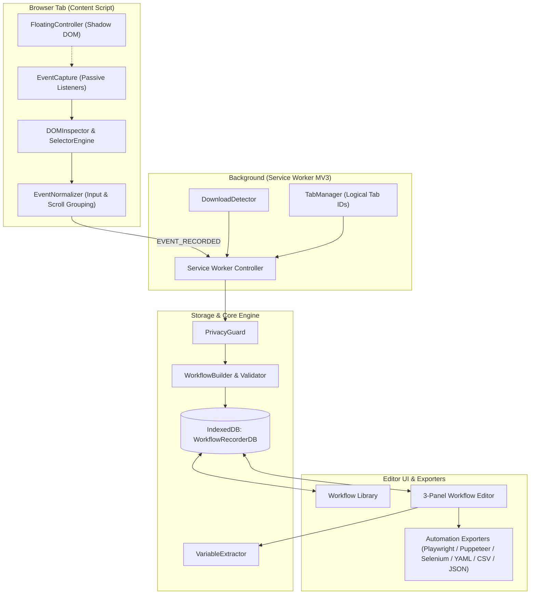

# Workflow Recorder — Advanced Chrome Extension

> A production-quality, privacy-first Google Chrome Extension (Manifest V3) that records user browser workflows, normalizes interactions into structured canonical steps, enables visual editing and variable parametrization, and exports to multiple automation and code formats.

---

## 🌟 Key Features

- **DOM-Intelligent Recording**: Captures semantic metadata, accessible roles, labels, and generates multi-candidate selector fallback chains (ID, testId, ARIA, CSS, XPath) rather than unstable screen coordinates.
- **Noise Filtering & Event Normalization**: Automatically groups keystrokes, collapses repeated inputs, debounces scrolls, and prevents recorder controller clicks from polluting workflows.
- **Privacy & Security First**: Zero external telemetry, 100% local processing in browser IndexedDB. Automatically masks passwords, OTPs, financial identifiers, credit cards, and query parameters.
- **Floating Recording Controller**: Shadow DOM isolated, draggable on-page bar providing real-time recording duration, step count, and pause/resume/stop controls.
- **Full Workflow Editor**: Professional 3-panel developer workspace for inspecting, adding, editing, reordering, duplicating, and disabling workflow steps.
- **Variable Parametrization**: Dynamic input scanner that automatically discovers literal inputs (emails, phones, dates, URLs, numbers) and binds them to `{{variable_name}}` templates.
- **Multi-Target Automation Exporters**:
  - **JSON**: Canonical, schema-validated JSON specification.
  - **YAML**: Clean, zero-dependency YAML serialization.
  - **CSV**: RFC 4180 compliant tabular step logs.
  - **Markdown**: Formatted runbook documentation with variable tables.
  - **Playwright JavaScript**: Executable ES module Playwright script.
  - **Playwright TypeScript**: Strongly-typed Playwright script with `WorkflowVariables` interface.
  - **Puppeteer**: Executable Node.js automation script with network-idle waits.
  - **Selenium Python**: Idiomatic Python script using Selenium WebDriver and WebDriverWait.
- **Multi-Format Importer Engine**: Import workflows from Canonical JSON, YAML, or tabular CSV with validation and automatic schema migration.
- **Developer Debug Mode & Settings**: Live event tracking metrics, sanitized debug log exports, and customizable recording, privacy, and timing controls.

---

## 🏗️ Architecture Overview



---

## 📂 Project Structure

```text
workflow-recorder/
├── dist/                     # Compiled, loadable Chrome Extension
├── public/icons/             # Manifest icons (16px, 48px, 128px)
├── schemas/
│   └── workflow.schema.json  # Canonical Draft 2020-12 JSON Schema
├── src/
│   ├── background/           # Manifest V3 Service Worker & detectors
│   │   ├── service-worker.ts
│   │   ├── download-detector.ts
│   │   └── tab-manager.ts
│   ├── content/              # Web page injection & floating overlay
│   │   ├── index.ts
│   │   ├── floating-controller.ts
│   │   └── file-upload-handler.ts
│   ├── core/                 # Core analysis and workflow logic
│   │   ├── dom-inspector.ts
│   │   ├── selector-engine.ts
│   │   ├── selector-scoring.ts
│   │   ├── selector-validator.ts
│   │   ├── selector-fallback.ts
│   │   ├── event-capture.ts
│   │   ├── event-normalizer.ts
│   │   ├── workflow-builder.ts
│   │   ├── workflow-validator.ts
│   │   ├── workflow-migrator.ts
│   │   ├── variable-extractor.ts
│   │   ├── smart-waits.ts
│   │   └── privacy-guard.ts
│   ├── editor/               # Full workflow editor & library UI
│   │   ├── App.tsx
│   │   ├── LibraryView.tsx
│   │   ├── WorkflowEditor.tsx
│   │   ├── StepList.tsx
│   │   ├── StepEditor.tsx
│   │   ├── StepPreview.tsx
│   │   ├── VariablePanel.tsx
│   │   └── ExportModal.tsx
│   ├── exporters/            # 8 automation export targets
│   │   ├── index.ts
│   │   ├── json.ts
│   │   ├── yaml.ts
│   │   ├── csv.ts
│   │   ├── markdown.ts
│   │   ├── playwright-js.ts
│   │   ├── playwright-ts.ts
│   │   ├── puppeteer.ts
│   │   └── selenium-python.ts
│   ├── popup/                # Extension action popup
│   │   └── App.tsx
│   ├── shared/               # Shared types, constants, messages, utilities
│   │   ├── types.ts
│   │   ├── constants.ts
│   │   ├── messages.ts
│   │   └── utils.ts
│   └── storage/              # IndexedDB repositories
│       ├── db.ts
│       ├── workflow-repository.ts
│       ├── settings-repository.ts
│       └── screenshot-repository.ts
├── tests/                    # 167+ automated unit & integration tests
├── manifest.json             # Manifest V3 configuration
├── package.json
└── tsconfig.json
```

---

## 🚀 Getting Started

### Prerequisites

- **Node.js** >= 18.0.0
- **npm** >= 9.0.0
- **Google Chrome** (or Chromium-based browser)

### Installation & Build

```bash
# 1. Clone repository and navigate to workspace
git clone <repo-url>
cd "WORKFLOW RECORDER"

# 2. Install dependencies
npm install

# 3. Compile extension to dist/
npm run build
```

### Loading into Google Chrome

1. Open Chrome and navigate to `chrome://extensions/`.
2. Enable **Developer mode** in the upper right corner.
3. Click **Load unpacked**.
4. Select the `dist/` directory inside the project folder.
5. The **Workflow Recorder** icon will appear in your Chrome extensions toolbar!

---

## 🛠️ Development & Quality Assurance

```bash
# Run all unit and integration tests (Vitest)
npm test

# Run TypeScript strict type verification
npm run typecheck

# Run ESLint across entire codebase
npm run lint

# Run development watcher
npm run dev

# Produce production build
npm run build

# Validate package compliance for Chrome Web Store
npm run validate:cws

# Build, validate, and create ready-to-upload ZIP for Chrome Web Store
npm run package
```

### 🚀 Chrome Web Store Publishing

To publish the extension to the Chrome Web Store:
1. Run `npm run package` — this builds, audits, and generates `release/workflow-recorder-v1.0.0.zip`.
2. Review the complete submission instructions, copy-paste reviewer justifications, and asset checklist in [Chrome Web Store Submission Guide](file:///c:/Users/USER01/Documents/CHROME%20EXTENSION/WORKFLOW%20RECORDER/docs/chrome-web-store-submission.md).
3. Upload `release/workflow-recorder-v1.0.0.zip` to the [Chrome Developer Dashboard](https://chrome.google.com/webstore/devconsole).
4. The standalone Privacy Policy is available at [docs/privacy.html](file:///c:/Users/USER01/Documents/CHROME%20EXTENSION/WORKFLOW%20RECORDER/docs/privacy.html).

---

## 🔒 Privacy & Security Model

- **Zero External Telemetry**: No tracking scripts, no third-party APIs, no cloud backends, no analytics beacons.
- **Local-First Architecture**: All workflow records and screenshots are stored exclusively within client-side IndexedDB.
- **Strict Credential Masking**: Password fields and input values matching sensitive patterns (PAN, Aadhaar, Cards, Tokens) are automatically scrubbed and represented as parameterized variables (e.g. `{{password}}`).
- **Least-Privilege Manifest**: Only requests essential Manifest V3 permissions (`storage`, `tabs`, `scripting`, `downloads`, `activeTab`). Does not request cookies, webRequest, browsing history, or debugger access.

---

## 📋 Documented Platform Limitations & Fallbacks

1. **Cross-Origin Iframes**: Chrome browser security (Same-Origin Policy) prevents parent scripts from directly accessing elements inside cross-origin iframes. In such cases, the recorder tracks the iframe container element and notifies the user gracefully.
2. **Internal Chrome Pages**: Extension content scripts cannot run on `chrome://` URLs, Chrome Web Store, or extension gallery pages due to browser security restrictions.
3. **Downloads Without Downloads Permission**: If the user revokes `downloads` permission, the recorder falls back gracefully without breaking recording workflows.

---

## 📚 Documentation Suite

Detailed architecture specifications and technical guides are available in the `docs/` directory:

- [Architecture Specification](file:///c:/Users/USER01/Documents/CHROME%20EXTENSION/WORKFLOW%20RECORDER/docs/architecture.md) — Comprehensive design of content scripts, service workers, storage, and message channels.
- [Canonical Workflow Schema](file:///c:/Users/USER01/Documents/CHROME%20EXTENSION/WORKFLOW%20RECORDER/docs/workflow-schema.md) — Draft 2020-12 schema specification with discriminated step unions.
- [Smart Selector Engine](file:///c:/Users/USER01/Documents/CHROME%20EXTENSION/WORKFLOW%20RECORDER/docs/selector-engine.md) — 5-tier fallback hierarchy, dynamic pattern rejection, and DOM validation.
- [Recording & Normalization Engine](file:///c:/Users/USER01/Documents/CHROME%20EXTENSION/WORKFLOW%20RECORDER/docs/recording-engine.md) — Keystroke grouping, scroll debouncing, and Shadow DOM isolation.
- [Privacy & Security Model](file:///c:/Users/USER01/Documents/CHROME%20EXTENSION/WORKFLOW%20RECORDER/docs/privacy.md) — Zero-telemetry model, credential masking, and strict CSP enforcement.
- [Automation Exporters Specification](file:///c:/Users/USER01/Documents/CHROME%20EXTENSION/WORKFLOW%20RECORDER/docs/exporters.md) — Playwright, Puppeteer, Selenium Python, and document exporters.

---

## 📄 License

MIT License. Designed and built with enterprise standards.
