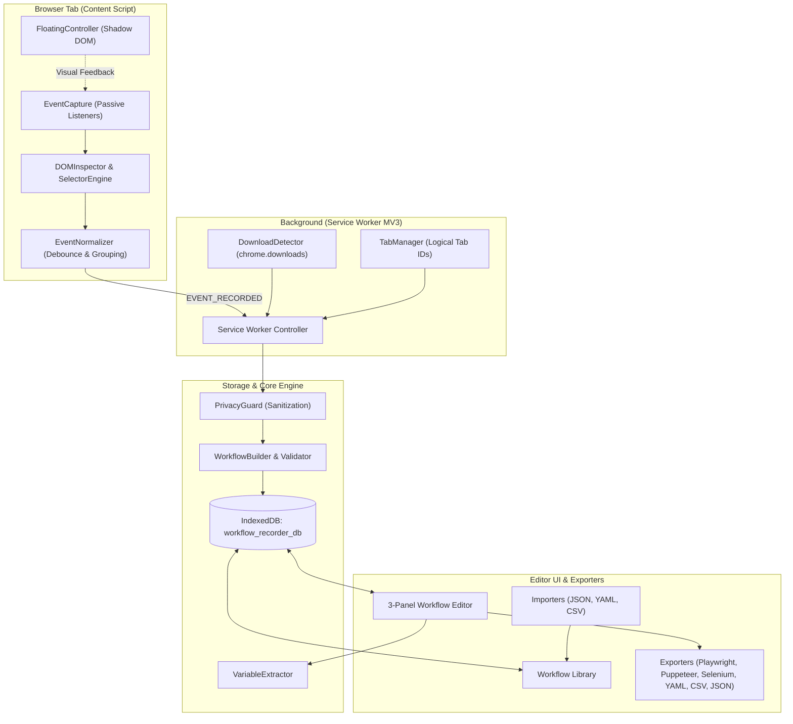

# Architecture Specification

## Overview

The **Advanced Chrome Workflow Recorder** is a privacy-first, local-first browser extension built for Google Chrome (Manifest V3). It records user interactions on web pages, normalizes noisy browser events into clean, logical automation steps, stores workflows locally in IndexedDB, provides a 3-panel developer editor for step organization and parameter binding, and compiles workflows into multiple enterprise-grade automation frameworks (Playwright, Puppeteer, Selenium Python) and document formats (JSON, YAML, CSV, Markdown).

---

## Architectural Principles

1. **Strict DOM Intelligence Over Mouse Coordinates**:
   - Workflows never rely on fragile viewport coordinates $(x, y)$ for element targeting.
   - Elements are inspected at interaction time, evaluating semantic attributes, accessible names/roles, stable IDs, test IDs, and structural hierarchies to generate a ranked 5-tier fallback cascade.

2. **Event Normalization & Noise Filtering**:
   - Raw DOM events (`keydown`, `input`, `keyup`, `focus`, `blur`, `scroll`) are normalized into logical user actions before being dispatched to the workflow builder.
   - Keystrokes are debounced and grouped into a single logical `input` action.
   - Rapid wheel events are debounced into a single `scroll` action.

3. **Isolated Content Script Injection**:
   - The on-page floating recording controller is rendered inside a closed/isolated **Shadow DOM** (`<workflow-recorder-controller>`).
   - Content script events originating from the recorder overlay are flagged with `data-workflow-recorder-ignore` and dropped immediately to prevent self-recording loops.

4. **100% Local-First & Zero Telemetry**:
   - All workflow recordings, metadata, settings, and screenshots reside entirely in client-side **IndexedDB**.
   - Zero outbound network requests (`fetch`, `XMLHttpRequest`, `navigator.sendBeacon` = 0).
   - No external AI API calls or cloud accounts required.

5. **Canonical Data Representation**:
   - Workflows are represented internally using a formal Draft 2020-12 JSON schema (`schemas/workflow.schema.json`).
   - Exporters are pure projection functions mapping the canonical data model into code or documents without mutating original records.

---

## Component Boundaries

### 1. Content Script (`src/content/`)
- `event-capture.ts`: Binds capture-phase event listeners for user actions (`click`, `dblclick`, `contextmenu`, `keydown`, `input`, `change`, `scroll`, `mouseover`).
- `dom-inspector.ts`: Extracts semantic metadata (`tagName`, `id`, `name`, `type`, `role`, `aria-label`, `textContent`, bounding rect) and discovers associated `<label>` elements.
- `selector-engine.ts`: Generates candidate selectors with stability scores and dynamic pattern rejection.
- `floating-controller.ts`: Shadow DOM UI showing recording duration, action counts, and control buttons (Pause, Stop, Settings).
- `file-upload-handler.ts`: Detects `<input type="file">` interactions, shields file binary leakage, and emits parameterized `upload` steps.

### 2. Background Service Worker (`src/background/`)
- `service-worker.ts`: Manages global recording state (`idle`, `recording`, `paused`), routes messages between content scripts and UI pages, coordinates badge counters, and captures tab screenshots.
- `download-detector.ts`: Subscribes to `chrome.downloads` lifecycle events to record `download` steps without exposing host paths.
- `tab-manager.ts`: Assigns stable logical IDs (`tab_1`, `tab_2`) to browser tabs for reliable cross-tab replay.

### 3. Core Engine (`src/core/`)
- `workflow-builder.ts`: Fluent immutable builder managing step addition, reordering, duplication, and variable registration.
- `workflow-validator.ts`: Validates workflow structural semantics against JSON schema definitions and business rules.
- `variable-extractor.ts`: Discovers candidates for parametrization (emails, phones, dates, URLs) and binds them to `{{variable_name}}` templates.
- `privacy-guard.ts`: Detects passwords, OTPs, financial identifiers, credit cards, and scrubs query tokens.
- `smart-waits.ts`: Analyzes transition points to insert explicit synchronizations (`waitForElement`, `waitForVisible`, `waitForURL`).
- `debug-tracker.ts`: Tracks telemetry on received, ignored, and logical actions with sanitized debug exports.

### 4. Storage Subsystem (`src/storage/`)
- `db.ts`: IndexedDB wrapper initializing stores for `workflows`, `workflow_summaries`, `screenshots`, and `settings`.
- `workflow-repository.ts`: Full CRUD operations with automatic summary synchronization and search/filtering/sorting.
- `screenshot-repository.ts`: Manages compressed WebP step previews.
- `settings-repository.ts`: Manages configuration with defaults fallback and `chrome.storage.local` broadcasting.

### 5. Exporter Engine (`src/exporters/`)
- Centralized dispatcher with 8 code generation targets:
  - Canonical JSON (`json.ts`)
  - Zero-dependency YAML (`yaml.ts`)
  - Tabular RFC 4180 CSV (`csv.ts`)
  - Formatted Markdown Runbook (`markdown.ts`)
  - Playwright JavaScript (`playwright-js.ts`)
  - Playwright TypeScript (`playwright-ts.ts`)
  - Puppeteer ES Modules (`puppeteer.ts`)
  - Selenium Python (`selenium-python.ts`)

### 6. Importer Engine (`src/imports/`)
- Multi-format import dispatcher accepting `.json`, `.yaml`, and `.csv`.
- Validates structural integrity before committing to storage.
