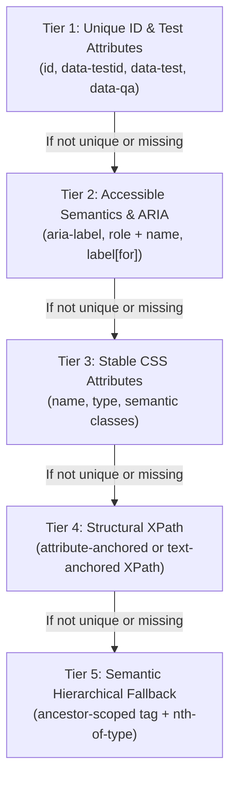

# Smart Selector Engine & DOM Intelligence

## Overview

The Selector Engine (`src/core/selector-engine.ts`) is designed to produce stable, unique, and human-readable selectors. Rather than producing a single fragile CSS path or relying on unstable screen coordinates, it generates multiple ranked candidates across a 5-tier fallback hierarchy and validates each candidate against the live DOM.

---

## 5-Tier Fallback Hierarchy

1. **Tier 1: Explicit Automation Anchors**
   - `#my-id` (only if non-dynamic)
   - `[data-testid="submit-button"]`
   - `[data-test="login-input"]`
   - `[data-cy="save-btn"]`

2. **Tier 2: Accessible Semantics & Labels**
   - `aria-label`: `button[aria-label="Submit Application"]`
   - Role + Accessible Name: `role="button"` + text
   - `<label for="...">`: Locates associated input via form controls

3. **Tier 3: Stable CSS Attributes**
   - Name attribute: `input[name="email"]`
   - Input type + placeholder: `input[type="text"][placeholder="Search"]`
   - Semantic CSS class chains with dynamic class pruning

4. **Tier 4: Structural XPath**
   - Robust attribute-anchored: `//button[@id='submit']`
   - Semantic text-anchored: `//button[normalize-space()='Submit']`

5. **Tier 5: Hierarchical & Semantic Fallback**
   - Relative paths anchored to the nearest unique ancestor:
     `#nav-container > ul > li:nth-child(2) > a`

---

## Dynamic Pattern Rejection

Modern single-page applications (React, Angular, Vue, CSS-in-JS libraries) generate random IDs and class names at build or runtime. The selector engine identifies and discards these patterns to prevent generating broken selectors:

- **CSS-in-JS Hashes**: `css-182jsd`, `sc-bdVaJa`, `styled-btn-8x92a`, `jss382`
- **Tailwind Generated Arbitrary Classes**: `[color:#123456]`
- **UUID & GUID Patterns**: `input-550e8400-e29b-41d4-a716-446655440000`
- **Timestamp & Epoch Strings**: `btn-1726402800123`
- **Hexadecimal/Random Sequences**: `item_a8f93e1b`

---

## Selector Scoring Algorithm

Each candidate selector is evaluated by `SelectorScoring` (`src/core/selector-scoring.ts`) producing a normalized confidence score between `0.00` and `1.00`:

$$\text{Score} = w_{\text{type}} \times S_{\text{type}} + w_{\text{uniq}} \times S_{\text{uniq}} - P_{\text{depth}} - P_{\text{length}} - P_{\text{volatility}}$$

### Base Type Weights ($S_{\text{type}}$)
- `testId`: $1.00$
- `id` (non-dynamic): $0.98$
- `aria`: $0.92$
- `name`: $0.85$
- `css`: $0.75$
- `xpath`: $0.70$
- `tag`: $0.40$

### Modifiers & Penalties
- **Uniqueness**: Matching exactly 1 DOM element yields $+0.15$; matching multiple elements penalizes proportionally (e.g. matching 10+ elements reduces score to $< 0.40$).
- **DOM Depth Penalty**: Deep nested paths (e.g. 6+ levels) suffer a linear penalty: $-0.02 \times \text{levels}$.
- **Length Penalty**: Selectors exceeding 80 characters incur $-0.05$.
- **Text Volatility**: Selectors relying on dynamic numerical text or timestamps are penalized.

---

## Live Selector Validation

`SelectorValidator` (`src/core/selector-validator.ts`) executes candidates against `document.querySelectorAll()` and `document.evaluate()` in the active DOM to verify:
1. **Match Count**: Whether the selector matches $0$, $1$, or $>1$ elements.
2. **Referential Equality**: Confirms that `matches[0] === targetElement`.
3. **Actionability**: Verifies element visibility and pointer-events capability.
